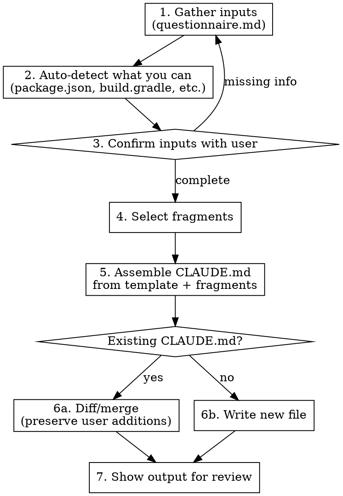

# Generating Project Standards

Generate tailored CLAUDE.md files by composing modular fragments based on project inputs (stack, domain, team size, regulated data, CI system).

## When to Use

- Starting a new project that needs a CLAUDE.md
- Onboarding an existing repo that lacks engineering standards
- User explicitly asks to generate or create project standards
- Replacing a generic/copy-pasted CLAUDE.md with a tailored one

**Do NOT use when:**
- User wants to edit a single rule in an existing CLAUDE.md (just edit it directly)
- Auditing compliance against existing standards (use audit-standards instead)
- Updating standards to match a newer template version (use upgrade-standards instead)

## Workflow



### Step 1: Gather Inputs

Read [questionnaire.md](questionnaire.md) and ask the user each question. Auto-detect answers where possible (Step 2) and present them for confirmation.

### Step 2: Auto-Detect

Before asking, try to infer:

| Signal | Look for |
|--------|----------|
| Language + build tool | `package.json`, `build.gradle`, `pom.xml`, `go.mod`, `Cargo.toml`, `pyproject.toml`, `requirements.txt`, `Gemfile` |
| Framework | Dependencies in manifest files |
| CI system | `.github/workflows/`, `.gitlab-ci.yml`, `Jenkinsfile`, `.circleci/`, `bitbucket-pipelines.yml`, `.woodpecker/`, `.woodpecker.yml` |
| Project type | Directory structure, entry points |
| Existing conventions | `.editorconfig`, `.eslintrc`, `.prettierrc`, linter configs |

### Step 3: Select Fragments

Based on inputs, select from [fragments/](fragments/):

**Universal (always included):**
- `testing-universal.md` — testing philosophy and gates
- `review-gate.md` — self-review checklist
- `security-generic.md` — baseline security scanning
- `honesty.md` — uncertainty protocol, no fabrication
- `boundaries.md` — "do not do" list
- `plan-act-reflect.md` — workflow for non-trivial changes
- `git-hygiene.md` — commit and branch conventions

**Stack-specific (pick one per stack):**
- `testing-java-gradle.md` — JaCoCo, Gradle commands
- `testing-go.md` — go test, coverprofile
- `testing-python.md` — pytest, coverage.py
- `testing-node.md` — Jest/Vitest, c8/istanbul
- `testing-rust.md` — cargo test, cargo-llvm-cov/tarpaulin

**Frontend testing (add if UI present):**
- `testing-frontend.md` — shared: Playwright, visual regression, a11y, bundle size
- `testing-react.md` — React Testing Library, MSW, hooks, Storybook
- `testing-vue.md` — Vue Test Utils, Testing Library, Pinia, composables

**Domain-specific (add if applicable):**
- `security-regulated.md` — PHI/PCI/PII compliance additions
- `ui-accessibility.md` — WCAG, a11y testing
- `data-privacy.md` — data handling, retention, anonymization

**Team-size variants:**
- `boundaries-solo.md` — relaxed guardrails for solo devs
- `boundaries-team.md` — stricter controls for shared repos

### Step 4: Assemble

Use [template.md](template.md) as the skeleton. Insert selected fragments at marked positions. Substitute variables:

| Variable | Source |
|----------|--------|
| `{{STACKS}}` | One or more stack entries, each with ROLE, LANGUAGE, BUILD_TOOL, FRAMEWORK |
| `{{STACK.ROLE}}` | "Backend", "Frontend", or omitted for single-stack projects |
| `{{STACK.LANGUAGE}}` | Detected or user-provided per stack |
| `{{STACK.BUILD_TOOL}}` | Detected or user-provided per stack |
| `{{STACK.FRAMEWORK}}` | Detected or user-provided per stack ("None" if no framework) |
| `{{TEST_COMMAND}}` | From stack fragment |
| `{{COVERAGE_COMMAND}}` | From stack fragment |
| `{{COVERAGE_THRESHOLD}}` | Default 95%, user can override |
| `{{CI_SYSTEM}}` | Detected or user-provided |
| `{{PROJECT_TYPE}}` | User-provided |

### Step 5: Handle Existing CLAUDE.md

If a CLAUDE.md already exists in the target directory:

1. Read the existing file
2. Identify user-added sections (anything not matching template markers)
3. Show a diff of what would change
4. Preserve user additions by appending them under a `## Project-Specific Rules` section
5. **Never silently overwrite** — always ask for confirmation

### Step 6: Review

Show the assembled CLAUDE.md to the user. Wait for explicit approval before writing to disk. Highlight:
- Which fragments were included and why
- Which were skipped and why
- Any variables that used defaults (user might want to override)

## Fragment Conventions

Each fragment file follows this structure:

```markdown
<!-- tier: global | project -->
<!-- requires: none | comma-separated fragment names -->

## Section Title

Content here. Include "why" comments to prevent cargo-culting:

<!-- WHY: Explanation of why this rule exists -->
```

- **tier: global** = belongs in `~/.claude/CLAUDE.md` (universal principles)
- **tier: project** = belongs in `./CLAUDE.md` (stack/domain-specific commands)
- Fragments are standalone and order-independent
- Each fragment should work if included alone

## Common Mistakes

- **Token bloat**: Keep fragments tight. If a fragment exceeds 50 lines, split it.
- **Hallucinated commands**: Every command in a stack fragment must be verified against the actual build tool docs. Never invent flags.
- **Clobbering**: Always check for existing CLAUDE.md before writing.
- **Over-customization**: Start with defaults. Users can edit after generation.
